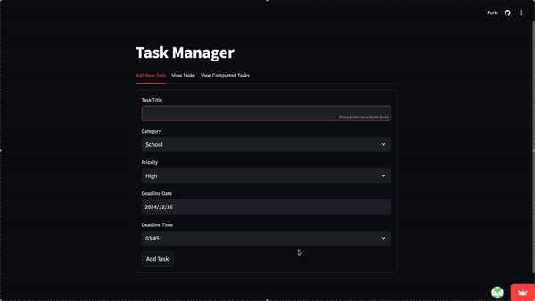

# Prioritized To-Do List App

---

## Project Overview

The **Prioritized To-Do List App** is a dynamic and user-friendly task management tool designed to make life easier when juggling personal and professional responsibilities.

https://prioritizedtodo.streamlit.app/

With this app, users can:
- **Organize Tasks**: Create and manage tasks with priority levels like **high**, **medium**, or **low**.
- **Categorize Tasks**: Assign tasks under **Work**, **Personal**, **School**, or other categories.
- **Set Due Dates**: Never miss a deadline with automated notifications for tasks nearing their due dates.

### Features:
1. **Filtering**: Focus on important tasks by filtering based on priority, due date, or category.
2. **Task History**: Review completed tasks and track your productivity over time.
3. **Productivity Boost**: Feel accomplished as you manage and complete tasks efficiently.

---

## Getting Started

### Prerequisites
- Python 3.8 or above.
- Required libraries listed in `requirements.txt`.

### Installation Steps
1. Install dependencies:
   ```bash
   pip install -r requirements.txt
   ```
2. Run the application:
   ```bash
   streamlit run app.py
   ```
3. Access the application in your web browser.

---

## Features Overview

1. **Task Creation**: Add tasks with details like priority level, category, and due date.
2. **Priority Management**: Easily sort and focus on high-priority tasks.
3. **Filters**: Quickly find tasks based on their priority, due date, or category.
4. **History View**: Look back on your completed tasks for a sense of accomplishment.
5. **Notifications**: Get notified of tasks approaching their deadlines.

---

## Usage Instructions

1. **Home Screen**:
   - Add tasks via the input field.
   - Use dropdowns to assign priorities and categories.
   - Include a due date (optional).

2. **Task Filters**:
   - Sort tasks using the filtering panel on the sidebar.
   - Choose filters like **Priority**, **Category**, or **Due Date**.

3. **Task History**:
   - Navigate to the **History** tab to view completed tasks.

---

## Known Issues & Future Enhancements

### Known Issues
- Notifications are not yet implemented for this version.
- Persistent storage for task history is currently not available.

### Future Enhancements
- Integration of calendar reminders and push notifications.
- Enhanced sorting and searching features.
- Persistent storage options like cloud integration or local databases.

---

## Contributing

Contributions are welcome! To contribute:
1. Fork the repository.
2. Create a feature branch:
   ```bash
   git checkout -b feature-name
   ```
3. Submit a pull request for review.

---

## Developer's Documentation

### Repository Structure
```
|- app.py           # Main Streamlit app
|- requirements.txt # List of dependencies
|- README.md        # User guide and project documentation
|- tasks.csv           # holds pending task data
|- completed_tasks.csv         # holds completed task data
```

### For Developers
1. Modularize your code for easy scalability.
2. Use `st.session_state` for managing session-level data.
3. Follow Streamlit’s deployment guide for hosting the app online.

## Demo
   

```


